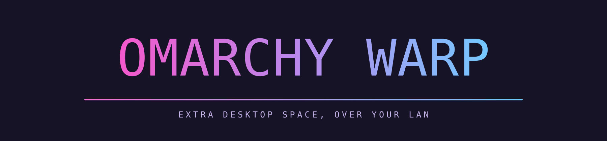
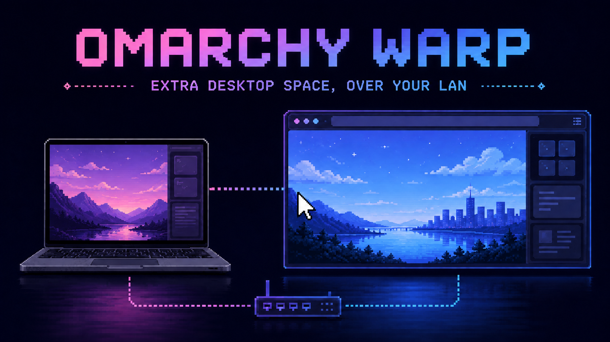
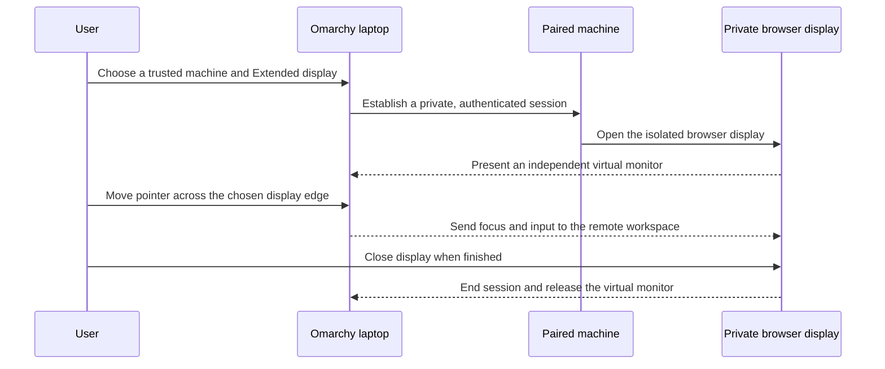
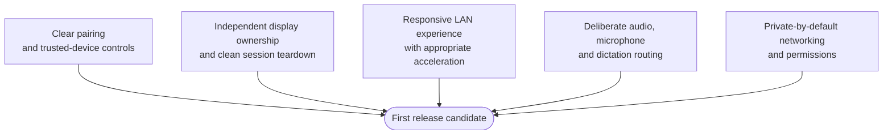

<p align="center">
  
</p>

# Omarchy Warp

> **Early beta. Public, but not recommended to use.**
>
> This is an early-beta snapshot so people can follow the work. It is not a
> supported install, not a security-reviewed release, and not a daily driver.
> Starting a live extended display is unfinished. Look, comment, or wait. Do
> not run this on a machine you care about. See
> [docs/DESKTOP-INSTALL.md](docs/DESKTOP-INSTALL.md).

## Install (Omarchy Linux, this user only)

```bash
git clone git@github.com:CG-8663/omarchy-warp.git
cd omarchy-warp
./install.sh
```

That writes launchers into `~/.local/bin` and an **Omarchy Warp** desktop entry. Add `--plugin` for the ⚡ bar widget. Add `--preview` to print the plan without writing. No `sudo`, no pacman.

`./install.sh` does not pair a computer, start wayvnc, or open a remote display.

Omarchy Warp explores a simple idea: use a trusted browser on another machine as extra desktop space for an Omarchy laptop.

The project started with a practical problem. A laptop may have no external monitor connected, while another machine on the same network has displays and graphics resources available. Omarchy Warp is testing whether that remote machine can provide a browser-based extended display that behaves like an additional monitor rather than a second, mirrored window.

## The concept at a glance

<p align="center">
  
</p>

The browser is the display surface. The laptop remains the primary computer; a trusted paired machine supplies the additional screen over the private local network, without publishing a public remote-desktop service.

## What the prototype demonstrates

- Pair a trusted machine and start an extended display session.
- Open a private browser session on that machine over the local network.
- Treat the browser session as its own monitor with its own workspace and tiles.
- Move the pointer between the laptop and the virtual display as naturally as moving between physical monitors.
- Keep the laptop workspace and remote display workspace separate.

The demo focuses on the experience of gaining more usable desktop space without adding another cable.

## A session, step by step



## The idea

A virtual monitor should feel familiar:

- The laptop remains the primary machine and keeps its existing desktop state.
- A remote browser becomes an independent extended display.
- Windows, focus, keyboard input and the pointer should follow the active display in a predictable way.
- Audio, microphone and dictation should eventually be routed deliberately, not accidentally captured by the wrong machine.

Omarchy Warp is not trying to turn every browser into an unmanaged public remote-desktop endpoint. The intended model is a private, trusted-device setup for a local network first, with secure remote access considered only after the local experience is solid.

## Current testing scope

The prototype is being tested on trusted devices on a local LAN. Local LAN is treated as trusted, so pairing does not ask for an SSH username or host fingerprint. Tailscale SSH is used automatically for Tailscale peers. The current focus is on:

- Starting and closing virtual monitor sessions reliably.
- Keeping each virtual monitor distinct from the laptop's own monitor and workspaces.
- Arranging the virtual monitor alongside the laptop display so the pointer crosses the correct edge.
- Making the browser session feel responsive enough for normal desktop work.
- Keeping the pairing and launch flow understandable for non-technical users.

The interface, transport, performance characteristics and device support are all still subject to change.

## What needs to be true before a first release



A first release needs to prove more than a successful demo. The key checks are:

1. **Reliable pairing**: users must be able to add and remove trusted machines without hard-coded hosts or confusing setup.
2. **Clear display ownership**: an extended monitor must own its own desktop state and must not hijack the laptop's tiles or pointer.
3. **Good local-network performance**: the display should be responsive and use available hardware acceleration where appropriate.
4. **Deliberate audio and input routing**: users need clear choices for audio, microphone and dictation on every remote display.
5. **Private-by-default networking**: no public exposure, strong device permissions and an understandable security model.
6. **Recoverable sessions**: closing a viewer or losing a connection must not leave the desktop in a confusing state.

## Roadmap

The near-term plan is to stabilise the LAN experience before expanding scope.

- Finish pairing and trusted-device management.
- Improve monitor arrangement and session lifecycle controls.
- Validate graphics acceleration and browser rendering on available hardware.
- Improve audio, microphone and dictation routing.
- Harden permissions and network exposure.
- Evaluate secure remote access and additional platform support only after the local workflow is reliable.

## First published code

- `install.sh` — one-command per-user install for an Omarchy laptop.
- `bin/warp-dashboard`, `bin/warp-control`, `bin/omarchy-warp`, `bin/omarchy-warp-workspace` — source-side desktop tool. Early beta.
- `omarchy-plugin/` — optional ⚡ bar widget (`./install.sh --plugin`).
- `web/index.html` — static browser-receiver shell. It does not connect to VNC and does not claim a live session.
- `docs/RELEASE-PROPOSAL.md` — first-release requirements: browser-only receiver on macOS, Windows and Linux.
- `docs/DESKTOP-INSTALL.md` — what the installer does and does not do.
- `docs/BROWSER-TEST.md` — how to try the viewer shell in Windows Edge, Chrome and Firefox.

The native macOS receiver, resource agent, and broker are not in this tree.

Run the checks:

```bash
python3 -m unittest tools.test_preflight tools.test_install web.test_index -v
./install.sh --preview --root /tmp/warp-home
```

`ready_for_install_preview` is a command listing, not permission to start a display. Native receiver, SSH launch into a Mac, and unauthenticated VNC are out of first-release scope.

## Contributors

Super Kevin and James Tervit are the contributors on this snapshot.

- **Super Kevin** (`kevin8663`) — contributor. Omarchy laptop operator. Standing portrait: `assets/credits/super-kevin-standing.png`.
- **James Tervit** (`jimthedj65`) — contributor and main developer. Creator and leader of Super Kevin and Chronara.
- **Chronara AI** — project home for this research snapshot.

The viewer shell and the Warp dashboard Credits window show the same three names. James Tervit is credited in text; Super Kevin and Chronara AI use local artwork.

The title artwork uses the [Omarchy Font](https://github.com/markcuda/Omarchy-Font) by Mark Cuda. It is an MIT-licensed fan project and is not affiliated with Omarchy or 37signals.

## Feedback

Questions and feedback are welcome, especially from people who work across a laptop, a desktop machine, TVs or other network-connected displays. The useful question is simple: would browser-based extended desktop space make your setup easier?
