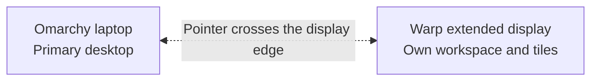

  

# Omarchy Warp

> **Status: early prototype. Testing for a first release.**

Omarchy Warp explores a simple idea: use a trusted browser on another machine as extra desktop space for an Omarchy laptop.

The project started with a practical problem. A laptop may have no external monitor connected, while another machine on the same network has displays and graphics resources available. Omarchy Warp is testing whether that remote machine can provide a browser-based extended display that behaves like an additional monitor rather than a second, mirrored window.

## The concept at a glance

The browser is the display surface. The laptop remains the primary computer; a trusted paired machine supplies the additional screen over the private local network, without publishing a public remote-desktop service.

## What the prototype demonstrates

- Pair a trusted machine and start an extended display session.
- Open a private browser session on that machine over the local network.
- Treat the browser session as its own monitor with its own workspace and tiles.
- Move the pointer between the laptop and the virtual display as naturally as moving between physical monitors.
